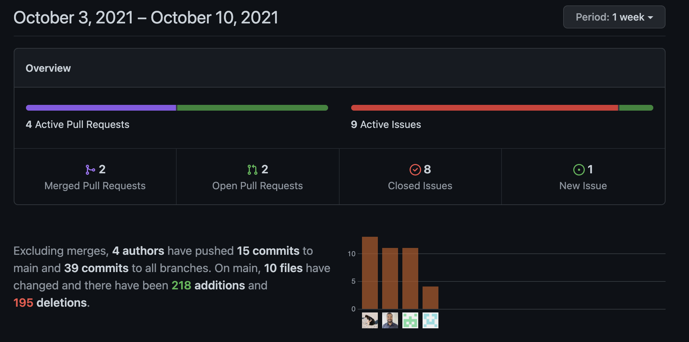

# CRYPTOCURRENCY SEARCH ENGINE

     Link: https://etta0311.github.io/Group-project-1/
## Table of Contents
   - User Story
   - Overview
   - Used Platforms & API
   - Usage
   - Credits
   - License

## User Story

    AS a cryptocurrencies investor
    I WANT a platform able to search for cryptocurrencies and all related info
    SO THAT I can keep myself updated with cryptocurrencies trend at one time.

## Overview

    Here we'd like to introduce our platform -- Cryptoworld. 
    This website is designed to enable user to be acquainted with lastest info of the cryptcurrencies they are looking for.
    With one-click on search, Cryptoworld will present you related updates and data under your need.

    Features as 
        - Currencies Rank
        - Current Price & 24-hour Market Change
        - Historical Price
        - Barcharts showing currencies trend 
        - Related Announcement / News for searched currency

## User Story

    AS a cryptocurrencies investor
    I WANT a platform able to search for cryptocurrencies and all related info
    SO THAT I can keep myself updated with cryptocurrencies trend at one time.

## Used Platforms & API
     - HTML
     - CSS
     - Javascript
     - jQuery
     - Moment.JS
     - Tailwindcss / Materialise
     - Coincap API
     - Nomics API
     - News API

## Usage

## Contributors

## Credits
    - https://coding-boot-camp.github.io/full-stack/github/professional-readme-guid
    - https://choosealicense.com/
    - https://htmlcolorcodes.com/
    - https://cssgradient.io/
    - https://bulma.io/
    - https://min-api.cryptocompare.com/data/top/mktcapfull?limit=10&tsym=USD&api_key=392a6d28d1f929c7a2e3db3d676655f975b2750caac92c06341c1239ade1fbc3
    - https://min-api.cryptocompare.com/data/v2/news/?lang=EN&api_key=392a6d28d1f929c7a2e3db3d676655f975b2750caac92c06341c1239ade1fbc3

    
## License
MIT License

Copyright (c) [2021]

Permission is hereby granted, free of charge, to any person obtaining a copy
of this software and associated documentation files (the "Software"), to deal
in the Software without restriction, including without limitation the rights
to use, copy, modify, merge, publish, distribute, sublicense, and/or sell
copies of the Software, and to permit persons to whom the Software is
furnished to do so, subject to the following conditions:

The above copyright notice and this permission notice shall be included in all
copies or substantial portions of the Software.

THE SOFTWARE IS PROVIDED "AS IS", WITHOUT WARRANTY OF ANY KIND, EXPRESS OR
IMPLIED, INCLUDING BUT NOT LIMITED TO THE WARRANTIES OF MERCHANTABILITY,
FITNESS FOR A PARTICULAR PURPOSE AND NONINFRINGEMENT. IN NO EVENT SHALL THE
AUTHORS OR COPYRIGHT HOLDERS BE LIABLE FOR ANY CLAIM, DAMAGES OR OTHER
LIABILITY, WHETHER IN AN ACTION OF CONTRACT, TORT OR OTHERWISE, ARISING FROM,
OUT OF OR IN CONNECTION WITH THE SOFTWARE OR THE USE OR OTHER DEALINGS IN THE
SOFTWARE.
